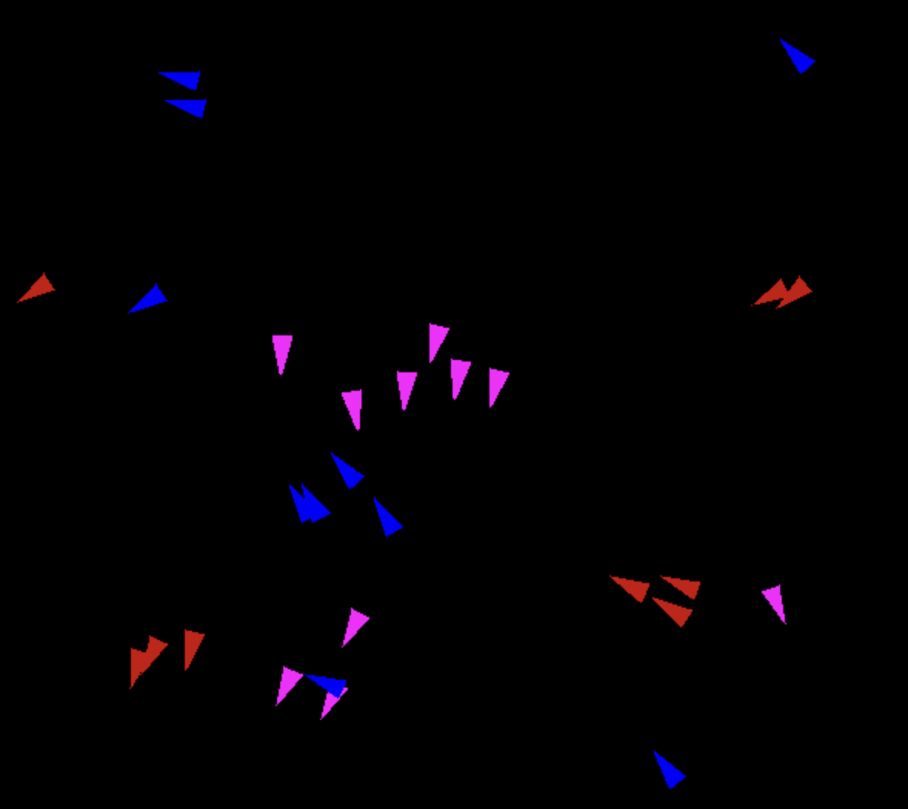

# Boids simulation with pygame

Work in progress.

## Todo

- [x] Add walls
  - [x] Add obstacle avoidance
  - [x] Walls have margins
  - [ ] Fix obstacle avoidance only turning right
  - [ ] Remove walls on click

- [ ] Correct flocking behavious

- [ ] Correct noise on/off
- [ ] Investigate Flock.boids

- [ ] Add keyboard shortcuts / mouse clicks
  - [x] Play/pause
  - [ ] Click to add boid
  - [x] Right click for wall
  - [ ] Clear universe
  - [ ] Reset to random universe
  - [ ] Noise on/off
  - [x] Add boids on mouse click

- [ ] Add GUI buttons/sliders
  - [ ] Clear universe
  - [ ] Reset to random universe
  - [ ] Noise on/off
  - [ ] Flocking behaviour weights adjustment
  - [ ] FPS/Speed adjustment
